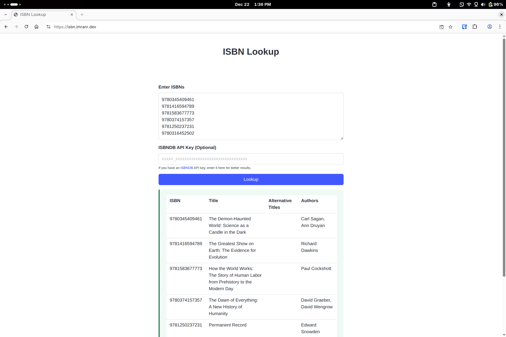
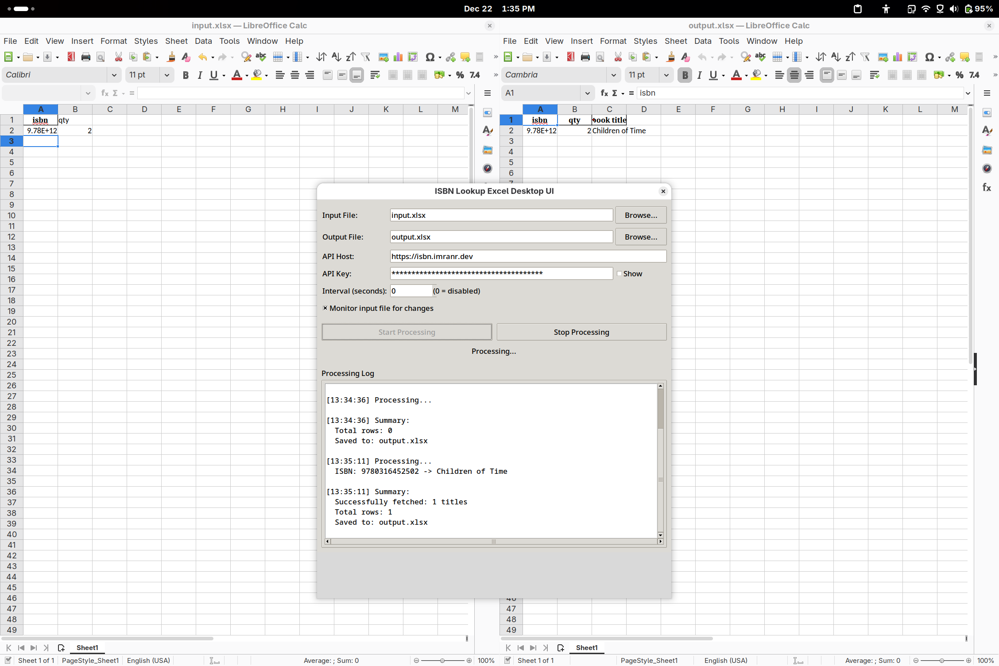

# ISBN Lookup

Find book titles and authors by ISBN. Supports mass search to look up multiple ISBNs at once.

## Usage (Node CLI and WebApp)

1. Clone the repository or download the ZIP file and extract it to a local directory.
2. Ensure Node.js is installed.
3. Install the required dependencies by running `npm install`.
4. Optional: Define a `.env` file with an `ISBNDB_API_KEY` variable.
   - You can also provide this as a runtime input param.
5. Run `npm start` to start the web app
   - Or use the CLI version by running `node cli.js <input file>` where `<input file>` is a `txt` or `xlsx` file containing a list of ISBNs (output will be generated as an `xlsx`).

## Usage (Python Desktop XLSX GUI)

This continuously watches a `.xlsx` file and produces a copy with items in the `"isbn"` column mapped to a new `"title"` column.

1. Clone the repository or download the ZIP file and extract it to a local directory.
2. Ensure Python 3 is installed.
3. Ensure you are in the `excel_desktop_ui` directory.
4. Install the required dependencies by running `pip install -r requirements.txt` (preferably in a `venv`).
5. Run `python isbn_lookup_excel_desktop_ui.py` to start the GUI app.

## APIs Used

The following APIs are checked (results are sorted by descending order of title length, and UI shows the top result):
1. [ISBNdb](https://isbndb.com/apidocs/v2) (if an API key is available)
2. [Google Books](https://developers.google.com/books/)
3. [Open Library](https://openlibrary.org/developers/api)